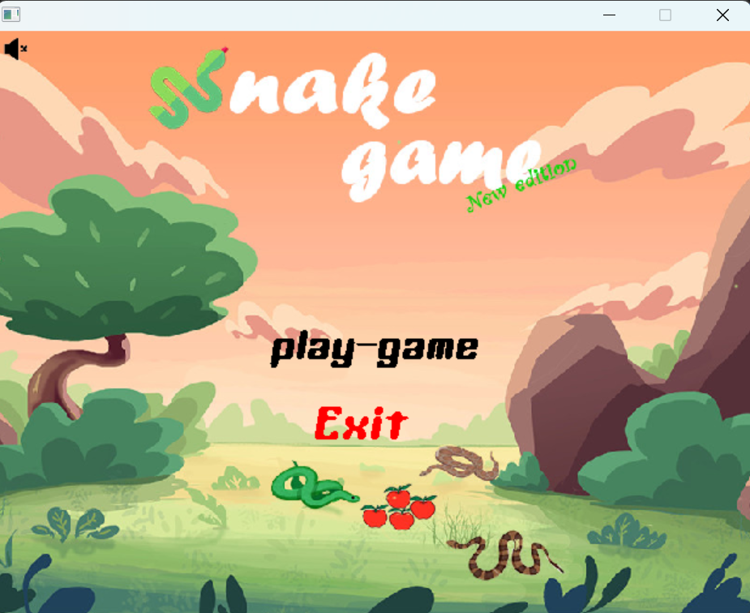
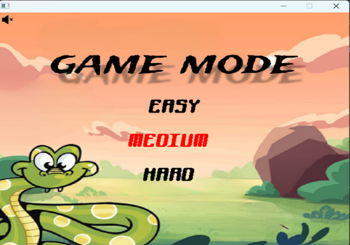
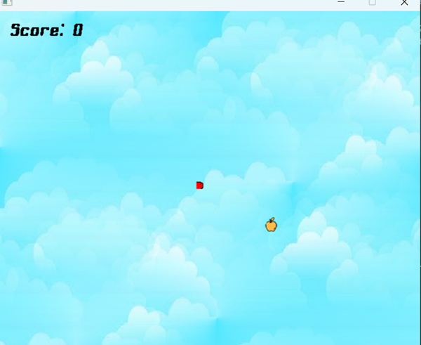
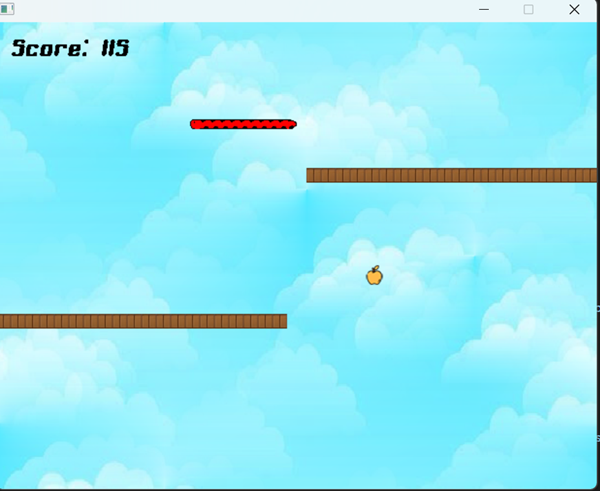
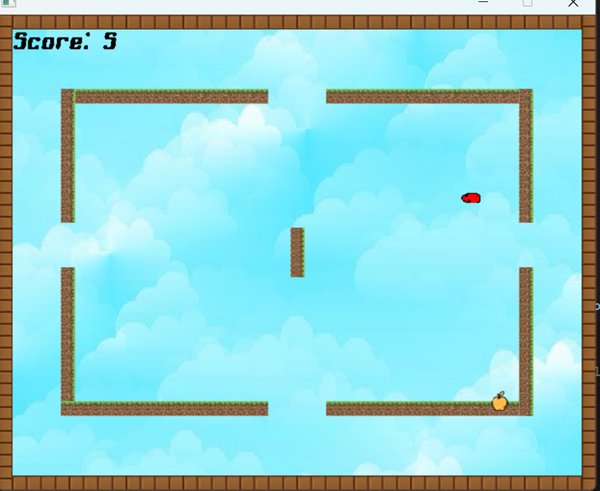
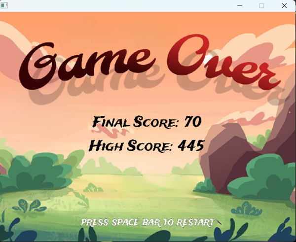

# 🎮Snake Game 🐍

## Author
**Name:** Sadman Shawon

## Student Information
- **Student ID:** 2021831007
- **Course Name:** SWE-150
- **Versity Name:** Shahjalal University of Science and Technology 

## Description
### *Game Description and Instructions*

A classic Snake Game implemented in C++ using the SDL2 library. The game involves controlling a snake to eat food, which makes the snake grow longer and increase the score. The objective is to avoid colliding with the walls or the snake itself.

*The game offers three modes for players to enjoy:*
+ **Game mode 1 - EASY:**
  
*In Easy Mode, the snake moves at a slower speed, making it easier for players to control and navigate. This mode is ideal for beginners who are new to the game or prefer a more relaxed gameplay experience.*
+ **Game mode 2 - MEDIUM:**
  
*In Medium Mode, the snake moves at a moderate speed, offering a balanced level of difficulty. This mode is suitable for players who have some experience with the game and are looking for a moderate challenge. The frequency of food appearance is standard, and the obstacles are moderately placed, requiring players to be more attentive.*
+ **Game mode 3 - HARD:**
  
*In this hard mode the snake moves very fast and there are more obstacles than medium mode this mode is designed for who seek challenging gameplay experience*


### *Control*

| Control | Player 1 | 
|---------|----------|
| UP      |     ↑    |     
| DOWN    |     ↓    |     
| LEFT    |     ←    |     
| RIGHT   |     →    |   

## *Preview*
#### *FirstScreen*
  


#### *GameMode Screen*



#### *Here are three modes Screen*
+ Easy Mode🐍

  

+ Medium Mode🐍

  

+ Hard Mode🐍

  
#### *GameOver Screen*

  


## Installation and Setup
 1 . **Dependencies:**
   + SDL2
   + SDL2_ttf
   + SDL2_mixer
   + SDL2_image
     
 2 .**Installation Steps:**
   
   + **Windows:**
       
       + Download and install SDL2 from the https://www.libsdl.org/.
       + Follow the instructions to set up SDL2 for your compiler.
## Compilation and Execution
  
 1 . **Compilation Instructions:**
   + **Windows:**
      ```bash
      g++ -I src/include -L src/lib -o main main.cpp -lmingw32 -lSDL2main -lSDL2 -lSDL2_ttf -lSDL2_mixer -lSDL2_image

     ```
 2. Build and run the game:
    ```bash
    makefile or
    ./main
    ```
## Features
 + Three difficulty modes: Easy, Medium, Hard.
+ Simple and intuitive controls.
+ Increasing difficulty as the snake grows longer.
+ Highscore tracking.

## Code Structure
+ **main.cpp:** Contains the core game logic and SDL setup.
## Contributing
+ Fork the repository.
+ Create a new branch.
+ Make your changes.
+ Submit a pull request.

## Known Issues and Bugs
+ No known issues at the moment. Please report any bugs you find.
## Future Improvements
+ Add a pause functionality.
+ Implement different types of food with varying effects.
+ Add more levels with different layouts and obstacles.

## Credits and Acknowledgments
+ SDL2 Library for providing the tools to create this game.
+ Tutorials from https://www.youtube.com/watch?v=QM4WW8hcsPU&list=PLvv0ScY6vfd-p1gSnbQhY7vMe2rng0I.


  
     
    
    


  


